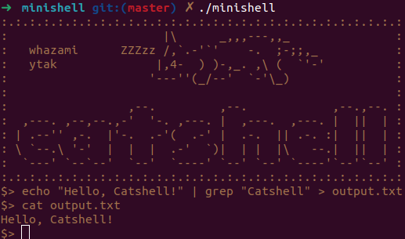

# Minishell

## Overview

This repository contains the implementation of a simple Unix shell, called "Minishell", developed as part of the 42 Paris curriculum. The purpose of this project is to demonstrate a basic understanding of operating system concepts, such as processes, signals, input/output management, error handling, and command execution.

The code is not provided as it's the rule of 42Seoul.

<div align="center">
  
</div>

## Features

* Basic command execution (e.g., ls, cat, grep, etc.)
* Built-in commands: echo, cd, pwd, export, unset, env, exit
* Command history
* Signal handling (e.g., CTRL+C, CTRL+\\, CTRL+D)
* Environment variable management
* Error handling and proper error messages
* Command line editing (e.g., left/right arrow keys, backspace)
* Redirections and pipes (e.g., >, <, >>, <<, |)

## Usage

1. Run the Minishell executable:
```bash
./minishell
```
2. You can now use Minishell to execute commands, manage environment variables, and explore its features.

## Acknowledgments

My project partner, [Yoojeong Tak](https://github.com/Yooyoo56), for her valuable collaboration, support, and ideas throughout the development of this project.
